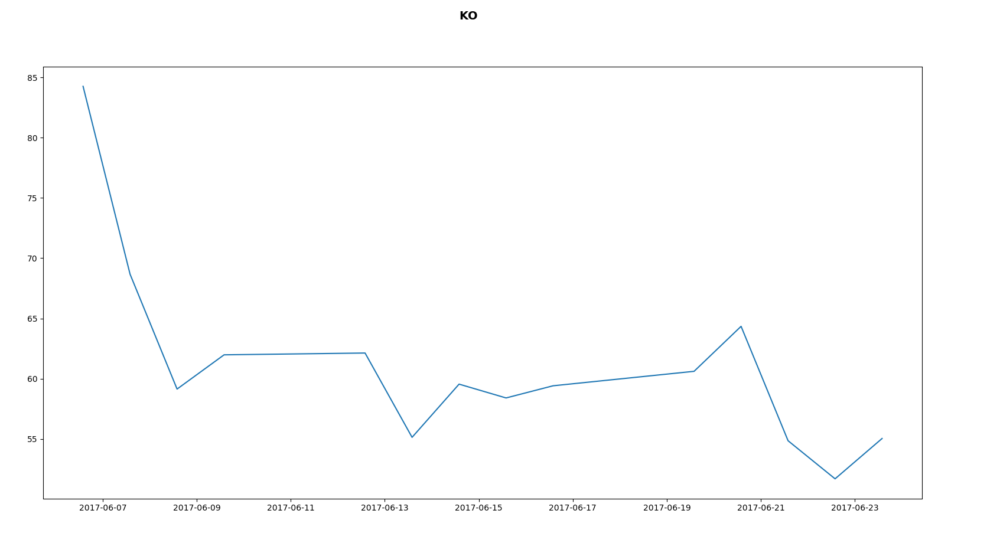
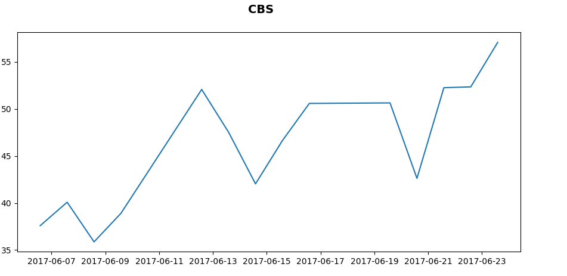

# ChartAnalytics

Chartanalytics is python program that produces strength indicator(RSI) for stock chosen by user. It uses 250 day smoothing to give more useful results for trading. Program uses pandas datareader to acquire course history and matplotlib to to draw graphs.

More info about RSI can be found here: http://stockcharts.com/school/doku.php?id=chart_school:technical_indicators:relative_strength_index_rsi

# Instructions

Program works by inputting symbol of the stock and choosing dayrange for RSI calculation. Most used day range for trading is 14 days. Then program opens new window containing RSI-graphfor given stock. You need to have pandas and matplotlib installed with pip. Program only works for stocks listed in US/UK markets, because of issue with pandas datareader. 

# Screenshots

14-day RSI:s for Coca Cola and CBS.

  
  

